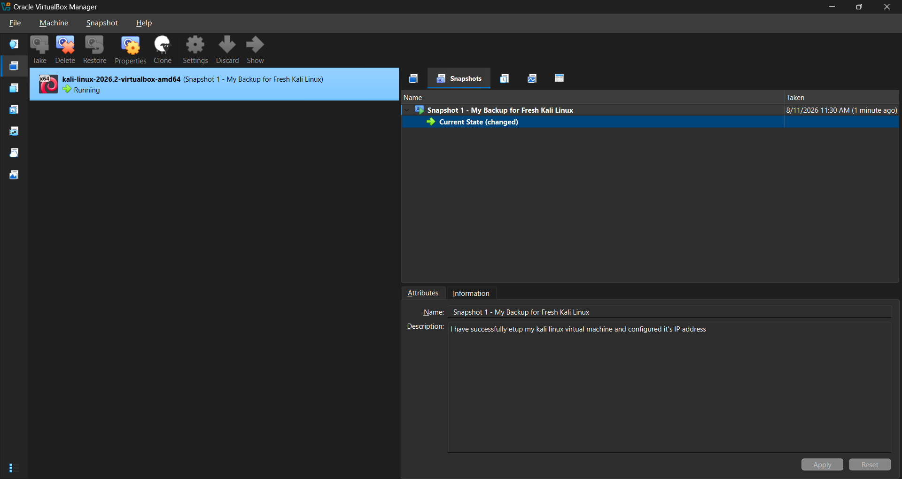

# networkwalks-B082-week1-Cybersecurity-lab-setup

**Building an isolated virtual laboratory for cybersecurity and penetration testing practice**

---

## Project Overview

This project focuses on setting up a virtual cybersecurity laboratory using **Oracle VirtualBox** and **Kali Linux**.

The purpose of this lab is to create a controlled environment where cybersecurity tools, network analysis, reconnaissance, vulnerability assessment, and other security exercises can be performed safely.

The laboratory is configured using a dedicated **NAT Network** with the `10.0.0.0/24` network range. This provides a suitable foundation for adding additional virtual machines and building a more advanced cybersecurity lab in future exercises.

---

## Objectives

The main objectives of this project are to:

- Install WinRAR for extracting the Kali Linux virtual machine files.
- Install and configure VirtualBox.
- Create a NAT Network using `10.0.0.0/24`.
- Download and import Kali Linux into VirtualBox.
- Configure the Kali Linux IP address.
- Verify network connectivity.
- Create a clean snapshot of the Kali Linux virtual machine.
- Prepare the environment for future cybersecurity exercises.

---

## Lab Configuration

| Component       | Configuration          |
| --------------- | ---------------------- |
| Host OS         | Windows 11             |
| Processor       | Intel Core i7 11th Gen |
| RAM             | 16 GB                  |
| Hypervisor      | Oracle VirtualBox      |
| Security OS     | Kali Linux             |
| Kali RAM        | 2048 MB                |
| Virtual Network | NAT Network            |
| Network Address | 10.0.0.0/24            |
| Kali IP Address | 10.0.0.2/24            |
| Default Gateway | 10.0.0.1               |
| DNS Server      | 8.8.8.8                |
| Future VM Range | 10.0.0.3–10.0.0.99     |

---

## Step 1. Install WinRAR

WinRAR was installed to extract the downloaded Kali Linux virtual-machine package.

Kali Linux virtual machines can be distributed as compressed archives, so an archive utility is required to extract the necessary virtual machine files.

**Tool:** WinRAR

---

## Step 2. Install VirtualBox

Oracle VirtualBox was installed as the hypervisor for the cybersecurity laboratory.

VirtualBox allows the Kali Linux operating system to run as a virtual machine while keeping the laboratory environment separated from the host operating system.

The installed VirtualBox environment was then prepared for the creation and configuration of the Kali Linux virtual machine.

---

## Step 3. Create the NAT Network

A dedicated NAT Network was created in VirtualBox for the cybersecurity laboratory.

The network was configured with:

```text
Network Name: NatNetwork
IPv4 Prefix:  10.0.0.0/24
DHCP:         Enabled
IPv6:         Disabled
```


The `10.0.0.0/24` network provides a private network range for the virtual machines.

A NAT Network was selected because multiple virtual machines connected to the same NAT Network can communicate with each other while also having outbound network connectivity.

This configuration will allow additional machines to be added to the laboratory in future exercises.

---

## Step 4. Download and Import Kali Linux

Kali Linux was downloaded and imported into VirtualBox as the primary security-testing operating system for the laboratory.

After importing the virtual machine, its network adapter was configured to connect to the previously created NAT Network.

The network configuration was set to:

```text
Adapter 1
Attached to: NAT Network
Network:     NatNetwork
```


The Kali Linux virtual machine was allocated:

```text
RAM: 2048 MB
```

After completing the import, Kali Linux was started to verify that the virtual machine was functioning correctly.

---

## Step 5. Configure the Kali Linux IP Address

The Kali Linux network configuration was checked and configured to operate within the laboratory's `10.0.0.0/24` network.

The intended configuration is:

```text
IP Address:      10.0.0.2
Subnet Mask:     255.255.255.0
Default Gateway: 10.0.0.1
DNS Server:      8.8.8.8
```

The IP address allows Kali Linux to be easily identified within the virtual laboratory.


The network configuration can be verified using:

```bash
ip addr
```

The routing table can be checked using:

```bash
ip route
```

Connectivity to the gateway can be tested with:

```bash
ping -c 4 10.0.0.1
```

Internet connectivity can be tested with:

```bash
ping -c 4 8.8.8.8
```

DNS resolution can be tested with:

```bash
ping -c 4 google.com
```

The new IP address can also be verified after applying the network configuration.


These tests help confirm that the Kali Linux virtual machine is correctly connected to the configured NAT Network.

---

## Step 6. Create a Clean VM Snapshot

After completing the Kali Linux installation and network configuration, a VirtualBox snapshot was created.

Example snapshot name:

```text
Clean Kali - Week 1 Setup
```



The snapshot represents the clean baseline of the virtual machine.

If future cybersecurity exercises modify the system or cause configuration problems, the virtual machine can be restored to this snapshot instead of reinstalling and configuring Kali Linux from the beginning.

Snapshots therefore provide a convenient recovery point for future laboratory exercises.

---

# Problems Encountered & Solutions

## Problem 1. Internet Connectivity After Static IP Configuration

After manually configuring the IPv4 settings, Internet connectivity may fail depending on the Kali Linux and NetworkManager configuration.

One workaround used during this lab was:

```bash
sudo nmcli connection modify "Wired connection 1" ipv4.dad-timeout 0
```

The network connection was then restarted or the system was rebooted, and connectivity was tested again.

> **Important:** Network interface and connection names may differ between systems. The actual connection name should be identified before running the `nmcli` command.

---

# What I Learned

Through this project, I learned how to build and configure a basic virtual cybersecurity laboratory using VirtualBox and Kali Linux.

The most important concepts I learned include:

### 1. Virtualization

I learned how VirtualBox can be used to run Kali Linux inside a virtual machine without installing it directly on the host operating system.

This makes it easier to create isolated environments for cybersecurity training.

### 2. NAT Network

I learned the difference between standard NAT and a NAT Network.

A NAT Network allows multiple virtual machines to communicate with each other while still providing external network connectivity through Network Address Translation.

This makes it useful for building a multi-machine cybersecurity laboratory.

### 3. Network Configuration

I learned how IP addresses, subnet masks, gateways, and DNS servers work together to provide network connectivity.

The laboratory uses:

```text
Network:  10.0.0.0/24
Kali:     10.0.0.2
Gateway:  10.0.0.1
DNS:      8.8.8.8
```

### 4. Network Troubleshooting

I practiced using basic Linux networking commands such as:

```bash
ip addr
ip route
ping
```

These commands can be used to identify common network configuration and connectivity problems.

### 5. Virtual Machine Snapshots

I learned how VirtualBox snapshots can be used to create a restore point for a virtual machine.

This is particularly useful in cybersecurity laboratories because future exercises may modify the operating system or its configuration.

---

# Future Improvements

This laboratory can be expanded in future projects by adding additional virtual machines.

Possible additions include:

- Windows 10/11 target machine
- Windows Server with Active Directory
- Vulnerable Linux machine
- Web application target
- SIEM platform
- Network monitoring tools
- Security monitoring agents

A future laboratory could use a topology similar to:

```text
Kali Linux       10.0.0.2
Windows VM       10.0.0.3
Linux VM         10.0.0.4
Windows Server   10.0.0.5
```

These machines could then be used for network scanning, vulnerability assessment, penetration testing, log analysis, threat detection, and incident-response exercises.

---

# Tools & Resources

- **WinRAR:** [Official WinRAR Website](https://www.win-rar.com/?utm_source=chatgpt.com)
- **VirtualBox:** [Official VirtualBox Website](https://www.virtualbox.org/?utm_source=chatgpt.com)
- **Kali Linux:** [Official Kali Linux Website](https://www.kali.org/get-kali/?utm_source=chatgpt.com)

---

# Author

**Alward Aladham**

Cybersecurity Professional  
Networkwalks B082

LinkedIn: [Alward Aladham](https://www.linkedin.com/in/alward-aladham/?utm_source=chatgpt.com)

---

## Project Information

**Program Name:** Cybersecurity at Networkwalks | **Week:** 01 | **Project:** Cybersecurity Lab Setup | **Repository:** GitHub